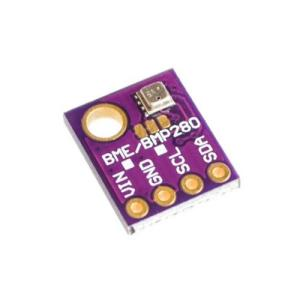

# pytempsense
pytempsense is library to access BME280 readings over I2C for Raspberry PI's or Tinker boards

[](https://travis-ci.org/rbuffat/pytempsense)

pytempsense was developed to access readings of BME280 breakout boards (as shown below) with Python on Raspberry Pis or Tinker boards. These boards can be bought cheaply from AliExpress and co. (Around 3$, 1Q2018).  This library uses the [official BME280 sensor API driver](https://github.com/BoschSensortec/BME280_driver).




## Installation


### Connect breakout board

The breakout boards need to be connected to the Raspberry Pi/Tinkerboard by the following connections:


|     BME280   |   Raspberry Pi |
| ------------- |:-------------:|
| VIN      | VCC 3.3 V (P1) |
| GND      | GND (e.g. P9)      |
| SCL |  I2C SCL (P5)     |
| SDA | I2C SDA (P3)  |

After connecting the breakout board you can check if the sensor is recognized by the system using the i2cdetect -y i2cbus command. For Raspberry Pi/Tinkerboards i2cbus is typically 1. If the sensor is recognized the output includes the number 76 or 77. Following is the output when the sensor is recognized correctly.

```console
>>> i2cdetect -y 1
     0  1  2  3  4  5  6  7  8  9  a  b  c  d  e  f

00:          -- -- -- -- -- -- -- -- -- -- -- -- --  
10: -- -- -- -- -- -- -- -- -- -- -- -- -- -- -- --  
20: -- -- -- -- -- -- -- -- -- -- -- -- -- -- -- --  
30: -- -- -- -- -- -- -- -- -- -- -- -- -- -- -- --  
40: -- -- -- -- -- -- -- -- -- -- -- -- -- -- -- --  
50: -- -- -- -- -- -- -- -- -- -- -- -- -- -- -- --  
60: -- -- -- -- -- -- -- -- -- -- -- -- -- -- -- --  
70: -- -- -- -- -- -- 76 --                       `
```


### Python library installation

First, you need to install cython in order to build the library:

`sudo pip install cython`

The library is tested with cython=0.28.1. If you have an older version and problems installing the library you should upgrade cython:

`sudo pip install --upgrade cython`

After installing cython, checkout the code from the GIT repository:

`git clone https://github.com/rbuffat/pytempsense.git `

Now you can install the library using the following commands:

`cd pytempsense`

`sudo python setup.py install`


## Basic usage

If the library is installed correctly, the following code is required to read sensor data. 

```python
from pytempsense import BME280

bme280 = BME280(i2cbus=1)

d = bme280.read()
```

`i2cbus` should thereby correspond to the one used for i2cdetect. The `read()` method returns a dictionary with the sensor values and a timestamp:

```python
{'pressure': 961.4, 'temperature': 21.9, 'timestamp': 1522700052.958628, 'humidity': 39.2900390625}
```


## Advanced usage

The BME280 sensor allows different modes, such as oversampling, filter or sensor mode. These options can be controlled using the BME280 class:

```python
BME280(i2cbus=1,
       humidity_oversampling=BME280Oversampling.X1,
       pressure_oversampling=BME280Oversampling.X1,
       temperature_oversampling=BME280Oversampling.X1,
       filter_coeff=BME280Filter.OFF,
       standby_time=None,
       sensor_mode=BME280SensorPowerMode.FORCED)
```


Please consult the BME280 datasheet to find the values that suits your use case. The default values correspond to the recommended mode for weather monitoring (see Chapter 3.5.1 in BME280 datasheet).  The options can be controlled using the helper classes `BME280Oversampling`, `BME280Filter`, `BME280StandbyTime` and`BME280SensorPowerMode`. 